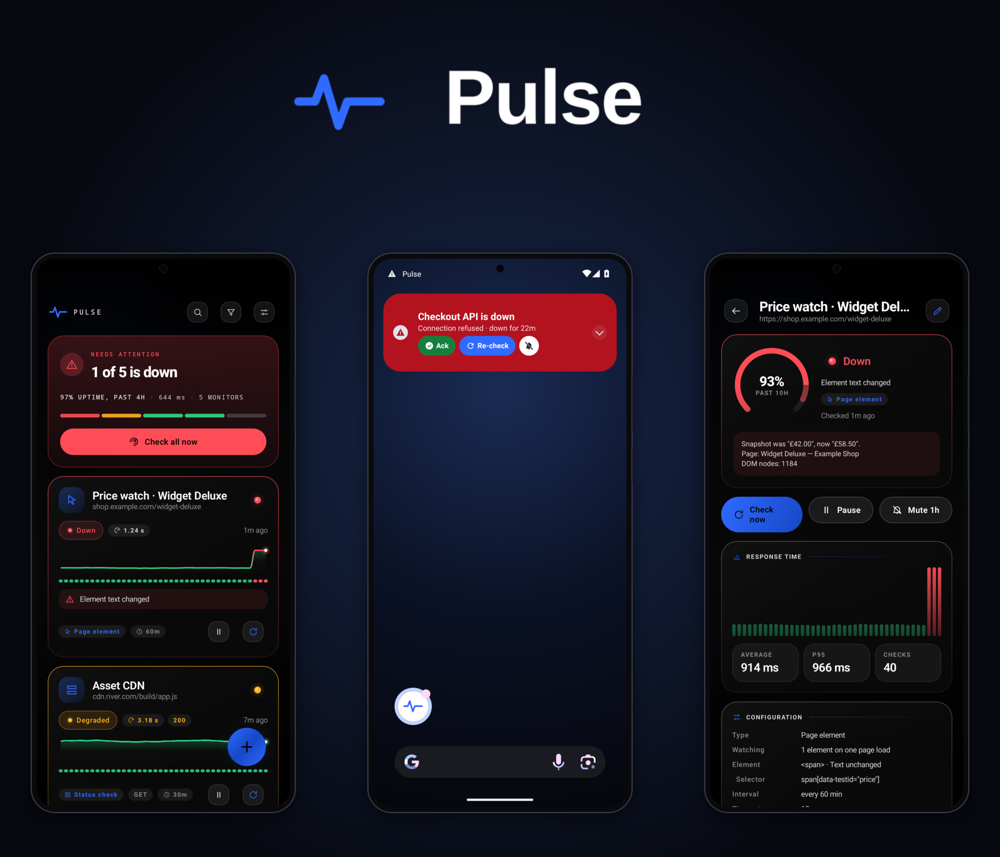
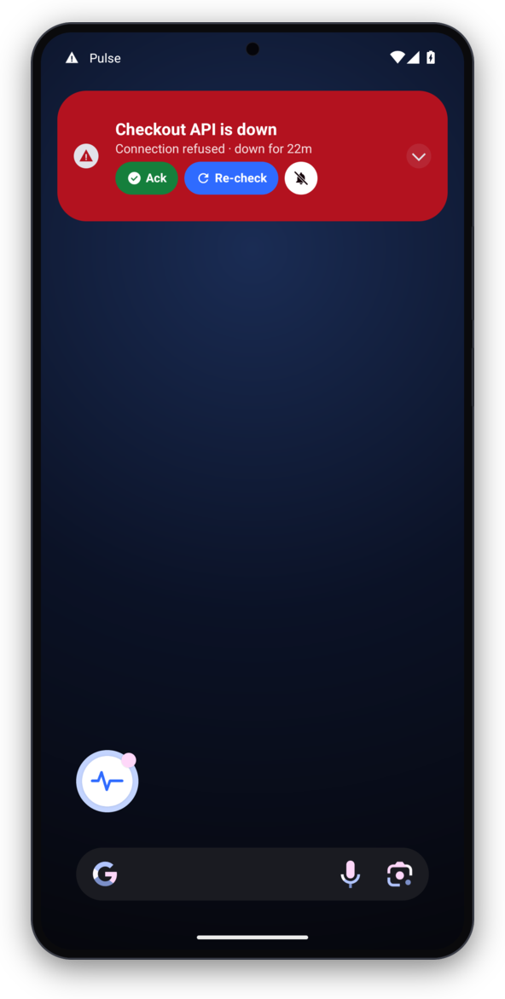
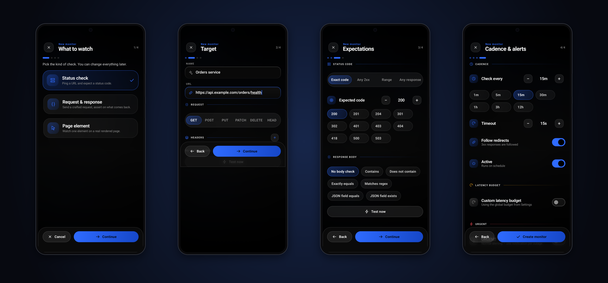
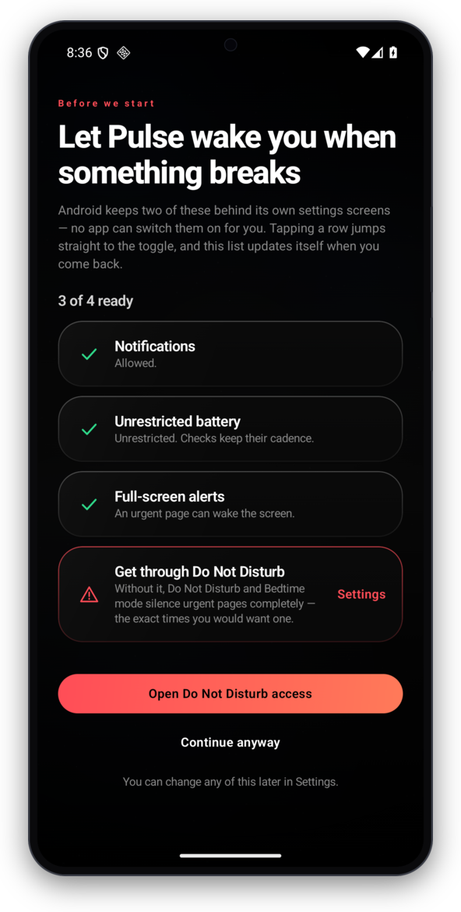
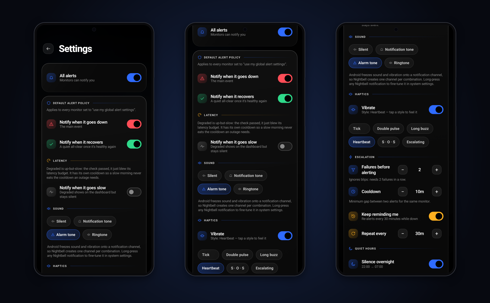
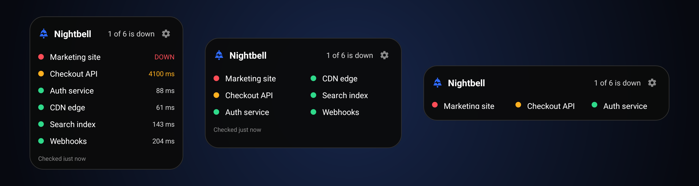
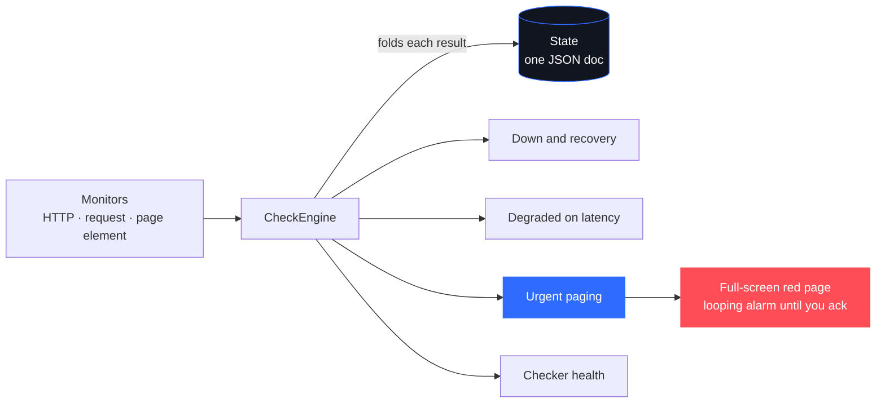

<div align="center">



### Uptime monitoring that lives on your phone and actually wakes you up.

<p>
  
  
  
  
  
  
  
  <a href="LICENSE"></a>
</p>

<p>
  <a href="../../releases/latest"></a>
  &nbsp;
  <a href="docs/reference.md"></a>
  &nbsp;
  <a href="../../issues"></a>
</p>

<p>
  <a href="#why">Why</a> &nbsp;·&nbsp;
  <a href="#what-it-watches">What it watches</a> &nbsp;·&nbsp;
  <a href="#getting-the-alerts-to-actually-arrive">Alerts</a> &nbsp;·&nbsp;
  <a href="#the-home-screen-widget">Widget</a> &nbsp;·&nbsp;
  <a href="#how-it-works">How it works</a> &nbsp;·&nbsp;
  <a href="#install">Install</a>
</p>

</div>

Point it at anything that answers over HTTP, or at one element on a rendered web
page, and it watches it, charts it, and gets loud when it breaks. **No server, no
account, no third party** — the phone in your pocket does the checking.

---

## Why

I kept missing outages. The monitoring services I tried either wanted a
subscription to text me, or sent a notification that looked exactly like a
marketing email and got swiped away with one. I wanted the thing that tells me
production is down to be impossible to confuse with anything else.

So urgent alerts in Pulse arrive as a red card that behaves like an incoming
call, with a looping alarm that keeps going until you acknowledge it, and it
wakes the screen if the phone is locked.

<div align="center">
  
</div>

> [!NOTE]
> Three buttons, because at 3am you want to decide one thing: **Ack** silences it,
> **Re-check** runs the check again there and then, and the crossed bell **mutes**
> that monitor for an hour.

---

## What it watches

| Kind | What it does |
| --- | --- |
| **Status check** | Hit a URL, assert on the status code. Exact, any 2xx, a range, or any response at all. |
| **Request and response** | Pick the method, set headers and a body, then assert on what comes back. Contains, does not contain, equals, regex, or a JSON field by path. |
| **Page element** | Loads the real page in an embedded WebView and watches DOM nodes you picked by tapping them. Existence, text, or an attribute. |

Page-element monitors watch any number of nodes per page and resolve them all
against one page load, so watching six costs about what watching one costs. The
expensive part is booting the WebView, not the assertions.

Setting one up is a four-step wizard — pick a kind, point it somewhere, say what
"healthy" means, and choose a cadence. Everything is changeable later.

<div align="center">
  
</div>

---

## Getting the alerts to actually arrive

This is the part every phone monitoring app gets wrong, so it is worth being
specific about.

> [!WARNING]
> Android will happily let an app *think* it is alerting you while delivering
> nothing. Pulse needs four grants, and there is a screen on first launch that
> walks you through them.

<div align="center">
  
</div>

| Grant | What breaks without it |
| --- | --- |
| **Notifications** | Nothing is posted at all. |
| **Unrestricted battery** | Android can refuse the service that owns the page and its repeat loop. |
| **Full-screen alerts** | A page on a locked phone cannot wake the screen. It waits on the lockscreen. |
| **Do Not Disturb access** | Bedtime mode silences urgent pages completely, which is exactly when you want one. |

Two of those show a dialog in place. The other two are Special App Access
toggles, and Android exposes no API to request them, so the screen deep-links
straight to each toggle and re-checks when you come back. It cannot be one tap
and it does not pretend to be. It is four taps instead of hunting three settings
sections.

Once they are granted, the alert policy is yours to shape — what counts as down,
how it sounds, the haptic pattern, how hard it escalates, and when to stay quiet.

<div align="center">
  
</div>

> [!TIP]
> Urgent pages follow your ringer switch by default — vibrate mode gets haptics
> only. There is a setting to override that if you want a pager that answers to
> nothing.

---

## The home-screen widget

Worst monitor first, tap a row to open it, tap the cog to reconfigure it. Every
piece of the header switches off independently — the mark, the word Pulse, the
"1 of 6 is down" summary, the cog — because "make it clean" means different
things to different people, and one flag for all four meant losing the summary to
keep the branding.

Monitors flow into columns. A widget dragged flat has spare width and no height,
so instead of pushing monitors below the fold and counting them in "+4 more",
they move sideways:

<div align="center">
  
</div>

Columns are chosen from the size the launcher reports, capped by width — no
number of monitors justifies a column too narrow to read a name in. Below about
150dp per column the trailing latency is dropped so the name keeps its room, and
a widget too short for a footer *and* a monitor drops the footer rather than
clipping both. `Columns: Auto` in the widget settings, or pin it to 1–3.

---

## How it works

One `CheckEngine` runs a check, folds the result into persisted state, and
decides whether to interrupt you. Four alert tracks come off that — deliberately
separate, so a bug in Pulse never gets reported as your website being down.



State is one JSON document in DataStore, which makes the whole store trivially
exportable. Checks run on WorkManager by default, or on a foreground service if
you turn on strict mode and want a cadence Android will not batch away.

<details>
<summary><b>The longer version</b></summary>

<br/>

`docs/reference.md` has the full account — the four tracks and why the checker's
health is one of them, count-based sample retention, the certificate track, the
light-theme re-pick, and the reasoning behind the awkward parts. It is the file
to read before changing anything load-bearing.

</details>

---

## Install

Grab the APK from [Releases](../../releases), or from `artifacts/` in this repo,
and sideload it.

```bash
adb install -r artifacts/Pulse-2.4.3-release.apk
```

> [!NOTE]
> It is signed with my own key, so Play Protect will ask you to confirm — there
> is no Play listing. Anything from 2.0.0 onward updates in place and keeps your
> monitors. 1.x used a different application id, so the only way across is the
> JSON export in Settings.

## Build

Needs JDK 17 and an Android SDK with API 36. `local.properties` wants
`sdk.dir=/path/to/Android/Sdk`.

```bash
./gradlew :app:assembleDebug          # debuggable
./gradlew :app:assembleRelease        # minified, needs keystore/keystore.properties
./gradlew :app:testDebugUnitTest      # 359 JVM tests
```

Release builds are signed from `keystore/keystore.properties`, which is
gitignored along with the key itself. Without it the release task still builds,
just unsigned.

<details>
<summary><b>Tests — 359 JVM + 173 on-device</b></summary>

<br/>

359 JVM tests cover the pure logic: the alert state machines, escalation,
quiet-hours arithmetic, assertions, the latency baseline, backup round-trips, and
the widget's column arithmetic — which decides whether a monitor is visible at all
and can otherwise only be exercised by dragging a widget around a home screen.
173 instrumented tests cover the parts that need a real Android: notifications,
channels, the foreground service, the WebView element checker, widgets, the
launcher icon's transparency, and a suite that drives a genuine
connection-refused outage all the way to a red page on screen.

```bash
# one class at a time, the emulator does not enjoy the whole suite at once
adb shell am instrument -w -e class me.river.pulse.UrgentPageEndToEndTest \
  me.river.pulse.debug.test/androidx.test.runner.AndroidJUnitRunner
```

The urgent path has a habit of breaking in ways only a device shows — the alarm
taking half a minute to stop after acknowledging, a custom notification layout
getting squashed vertically, colorisation being silently dropped. None of that is
visible from reading the code, so those cases got tests that were checked against
the broken version first.

</details>

## Known limitations

> [!IMPORTANT]
> Quiet hours still suppress urgent pages unless you turn on the bypass. That
> default is wrong and is the next thing I want to fix properly — with a
> migration, not a flipped constant.

- Element checks need a WebView per page load. They are the slow kind of check.
- Strict mode costs battery and a permanent notification. That is Android's price
  for a real cadence, not a design choice.
- No CI. The test commands above are run by hand.

## Licence

Apache 2.0, see [LICENSE](LICENSE). Same licence as everything it depends on
(androidx, Compose, OkHttp, kotlinx), so there is nothing awkward to reason about
if you want to fork it or lift a piece of it.

Do what you like with it. Keep the notice, and say what you changed.

<div align="center">
  <br/>
  <sub>Built to be impossible to confuse with a marketing email. If it saved you an outage, a ⭐ is appreciated.</sub>
</div>
