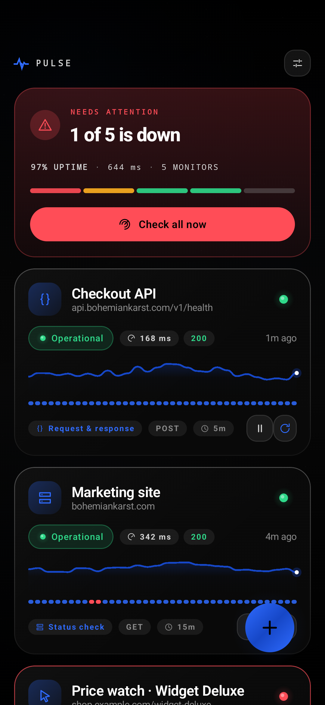
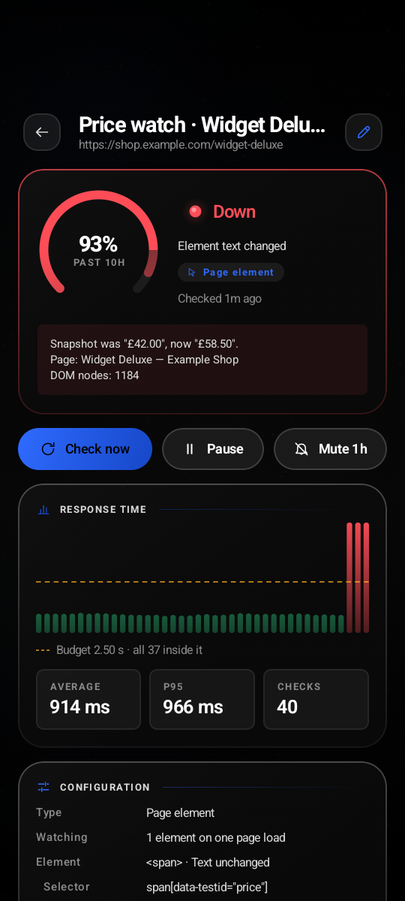
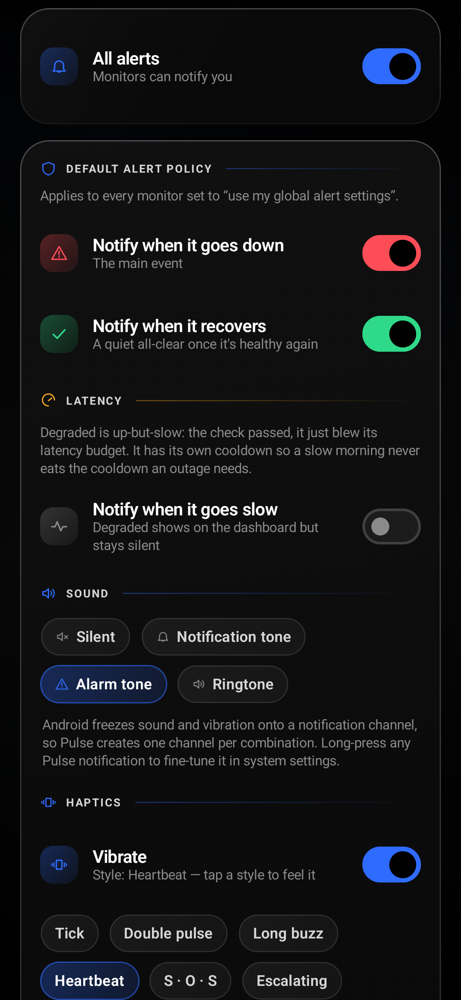

# Pulse

A premium, glassmorphic Android monitoring app. Point it at anything that
answers over HTTP — or at a single element on a rendered web page — and it will
watch it, chart it, and shout when it breaks.

<p align="center">
  
  
  
</p>

---

## What it monitors

| Kind | What it does |
| --- | --- |
| **Status check** | Ping a URL, assert on the status code (exact / any 2xx / range / any). |
| **Request & response** | Full control: GET·POST·PUT·PATCH·DELETE·HEAD, custom headers, request body and content type, plus a response-body assertion. |
| **Page element** | Loads the real page in an embedded browser and watches **any number** of DOM nodes you picked by tapping them — all resolved against one page load. |

**Response-body assertions:** contains · does not contain · exactly equals ·
matches regex · JSON field equals · JSON field exists. JSON paths support
nesting and array indices (`data.items[0].state`).

**Element expectations:** element exists · element is gone · text equals ·
text contains · text unchanged (snapshot). You can also compare an attribute
(`href`, `value`, `data-state`, …) instead of the visible text.

Each watched element carries its own expectation and an optional nickname. The
list is a **conjunction** — one mismatch marks the monitor down, and the alert
names the element that broke. Booting the WebView and waiting for hydration is
what an element check actually costs, so watching six nodes costs almost exactly
what watching one costs.

## Alerting

Every monitor either inherits the global alert policy or overrides it:

- **Down** and **recovery** notifications, independently toggleable.
- **Degraded** (latency-SLO) notifications on their own track — see below.
- **Sound**: silent · notification tone · alarm tone · ringtone.
- **Haptics**: six named patterns — Tick, Double pulse, Long buzz, Heartbeat,
  S·O·S, Escalating. Tapping a style plays it immediately so you can feel it
  before you trust it.
- **Escalation**: failure threshold (ignore blips), cooldown between alerts,
  optional repeat-while-down nagging.
- **Quiet hours** with midnight wrap-around, and an optional
  "still notify, but silently" bypass.
- Inline notification actions: **Re-check now**, **Mute 1h**, and
  **Acknowledge** on urgent alerts.

Android freezes sound and vibration onto a notification channel at creation
time, so a single channel could never honour per-monitor choices. Pulse
materialises one channel per `(sound × vibration style × severity)` combination
on demand and routes each alert to the matching one. Channels are grouped so the
system settings screen stays readable.

### URGENT mode

A per-monitor switch for the things you cannot afford to sleep through.

While an URGENT monitor is down, Pulse re-posts **one** notification on a
dedicated, DND-bypassing alarm channel every *N* minutes (default 5) until you
acknowledge it — from the notification action or from the monitor screen. It is
`ongoing`, so it cannot be swiped away.

Acknowledging stops the repeats **for that outage only**. The monitor stays red,
the ordinary down notification stays where it was, and recovery re-arms the
loop, so the *next* outage shouts again. Urgent overrides cooldown and the
repeat toggle — that is the point — but still honours the master switch, the
per-monitor alert switch, mute, the failure threshold and quiet hours. It means
"don't let me miss it", not "ignore everything I configured".

The whole state machine is `domain/UrgentAlerts.kt`: pure, and exhaustively
tested.

Because the urgent notification is `ongoing` — deliberately un-swipeable — its
lifecycle is treated as a **reconciliation, not a transition**. A healthy check
always issues a cancel rather than inferring one isn't needed, checks of one
monitor are serialised behind a per-monitor lock, and every tick sweeps
`getActiveNotifications()` against the ids monitors can currently justify. That
last one is the only way to catch a notification belonging to a monitor that has
since been deleted. See HANDOFF for the field bug that prompted all three.

### Latency SLOs and DEGRADED

`Health.DEGRADED` now means something. Give a monitor a **latency budget** (or
inherit the global default, 2.5 s) and a successful response slower than it
becomes DEGRADED — amber, not red, because the service answered.

Degraded has its own alert track with its own cooldown, its own repeat setting
and its own recovery notification, deliberately independent of the down track:
"slow" and "broken" are different incidents, and a slow morning should not eat
the cooldown an outage needs. An outage always supersedes slowness, so you never
get two notifications for one event.

### How background checks actually run

Three layers, and the app is explicit about what each one can promise:

| Layer | Cadence it can honour | Notes |
| --- | --- | --- |
| Per-monitor `PeriodicWorkRequest` | the monitor's interval, **floored at 15 min** | Android's floor, not a Pulse setting |
| 15-minute repair sweep | anything overdue, at 15-min granularity | also re-arms missing periodic work |
| Strict foreground service | exactly as configured, down to ~15 s | costs a permanent notification and battery |

**Sub-15-minute intervals cannot be honoured in the background.**
`PeriodicWorkRequest.MIN_PERIODIC_INTERVAL_MILLIS` is 15 minutes and WorkManager
clamps anything shorter, silently. Pulse clamps it *visibly* instead: the
scheduler coerces to the floor, the sweep still picks the monitor up as overdue
on every wake, and the Settings → **Checker health** card says so in as many
words. Strict mode is the only way to get the interval you asked for, and that is
the honest answer rather than a promise the platform will not keep.

Nothing re-arms itself from inside its own execution, and every reconciliation
uses a policy that **cannot cancel work in flight**
(`ExistingPeriodicWorkPolicy.UPDATE` for cadence, `ExistingWorkPolicy.KEEP` for
"check now"). That is not a style preference — see the 1.6.0 section of HANDOFF
for what the previous `REPLACE`-everywhere design did to real users.

### Checker health, separately from monitor health

A check can fail to produce an answer for three very different reasons, and Pulse
now keeps them apart:

| | What it means | What the user gets |
| --- | --- | --- |
| **Monitor failure** | the site is down, the selector is gone, the status is wrong | notification + vibration, per policy |
| **System-limited** | Doze, battery saver, no connectivity, background restricted | shown in Settings; **never** a notification |
| **Checker fault** | an exception escaped Pulse's own checker code | its own quiet channel, only once verified |

The middle row is the one that was missing, and its absence is why cancelled
checks used to arrive as outages. A checker fault needs **three consecutive
internal errors with no completed check in between** before it says anything, is
held in memory only (so a restart cannot inherit a stale claim), and clears the
instant any check produces a verdict — passing *or* failing.

**Coroutine cancellation is not any of the three.** WorkManager replacing work, a
foreground service stopping and a screen going away all cancel checks constantly;
none of them is evidence about anything, and Pulse records and says nothing.

### Strict foreground monitoring

WorkManager is the right default — battery-friendly, survives reboots — but Doze
can defer work for a long time and its periodic minimum is 15 minutes. A monitor
set to "check every minute" does not check every minute.

Turning on **strict foreground monitoring** runs a foreground service that keeps
your intervals exactly. It sleeps until the next monitor is actually due rather
than polling on a fixed tick, and WorkManager stays armed underneath as a repair
sweep, so a service the OS kills still gets checks eventually.

The tradeoffs, stated plainly in the UI as well as here:

| | Strict off (default) | Strict on |
| --- | --- | --- |
| Cadence | best-effort; Doze may delay | as configured, down to ~15 s |
| Battery | negligible | real — a wake per due check |
| Notification | none | permanent, un-dismissable (Android's rule) |
| Survives reboot | yes | yes |
| Survives OS kill | yes | restarted by `START_STICKY` + the sweep |

An unacknowledged URGENT outage starts the same service on its own regardless of
the setting, and stops it the moment you acknowledge or the monitor recovers.

The service declares `foregroundServiceType="specialUse"` rather than
`dataSync`, because `dataSync` is capped at six hours per day on API 34+ — which
would silently break the one guarantee strict mode exists to make. Shipping this
through Google Play would need that subtype justified in review; sideloading is
unaffected.

## Home-screen widget

A worst-first list of monitors, configurable per instance:

- **Theme**: black · white · blue — each a solid rounded surface, because a
  widget has to stay legible on a white beach photo and a black AMOLED wallpaper
  alike, and translucency cannot promise that.
- **Density**: compact (dot · name · status) or detailed (adds host, latency and
  the failure message).
- Show/hide the app title and logo, show/hide the last-checked footer, and
  optionally hide healthy monitors entirely.
- Row cap, with any overflow disclosed as "+N more" rather than silently
  truncated.

Tapping the widget opens the dashboard; tapping a row deep-links to that
monitor's detail screen. Placing several widgets gives each its own
configuration, stored in a separate DataStore keyed by `appWidgetId` so a
corrupt widget preference can never take the monitor list down with it — and so
it survives an APK update. Widgets refresh after every completed check, plus the
platform's 30-minute periodic tick.

### Finding a placed widget's settings

Three routes, because the platform only reliably gives you one and it did not
exist below Android 12:

1. **The cog in the widget itself.** Works on every launcher and every API level;
   can be switched off per widget if you prefer the cleaner look.
2. **Long-press the widget** → its settings entry. This is
   `widgetFeatures="reconfigurable"`, added in API 31 and ignored below it.
3. **Settings → Home-screen widgets**, which lists every placed widget.

Reported as a real problem: once the widget was on the home screen its
configuration was unreachable.

### Colours and transparency

Three presets (black, white, blue) plus **Custom**: a background colour, a text
colour, and a background-opacity slider that goes all the way to zero — at which
point the widget is text on your wallpaper and nothing else.

The surface is a tintable `ImageView` behind the content, not a background
drawable on it, because `RemoteViews` cannot recolour a `View` background on
API 26–30. `setColorFilter` plus `setImageAlpha` give an arbitrary colour at an
arbitrary opacity while keeping the rounded corners a flat `setBackgroundColor`
would throw away. The hairline edge is its own layer and fades out with the
surface, so a fully transparent widget has no ring floating around it.

Presets deliberately ignore the opacity slider: they are defined surfaces with
known contrast, and letting a stray opacity value apply to them would quietly
turn a legible preset illegible. Picking a pale custom background moves the text
colour to something readable *unless* you have already chosen one yourself.

## Moving between installs

**Settings → Backup and transfer** writes every monitor, its sample history and
your settings to a JSON file, through the Storage Access Framework — so Pulse
needs no storage permission, the destination is yours to pick, and nothing is
uploaded anywhere.

It also exists because **2.0.0 changed the app's `applicationId` to
`me.river.pulse`, and that is not a rename.** Android identifies an app by that
id, so 2.0.0 installs *beside* an earlier version rather than updating it: new
data directory, no monitors, and no way for it to read the older install's files.
No signing key or manifest setting changes that. Export from the old install,
install 2.0.0, import — and export **before** uninstalling anything, because once
the old app is gone so is its data.

Placed home-screen widgets do not come across either: a launcher stores the
provider as a fully-qualified class name, so they belong to the old app. Drag them
back on after importing; their settings are in the backup.

An import **replaces** what is on the device rather than merging, and says so
before it does it. What it carries is monitors, settings, mute windows and
history. What it deliberately does not carry is any record of notifications
already posted: health resets to unknown until this install has actually checked
something, and the alert bookkeeping resets with it. Importing an in-progress
alert state would suppress the first real outage on the new device — see the
1.7.0 and 2.0.0 sections of HANDOFF for why that is the same trap twice.

## The element picker

1. Enter a URL and tap **Open live preview**.
2. The page loads in a real WebView. Browse and scroll normally.
3. With *Tap to select* on, tap the node you care about.
4. Injected JS derives a durable signature and streams it back over a JS bridge:
   `id` → stable data-attribute (`data-testid`, `aria-label`, …) → shortest
   unique CSS path → absolute XPath → text fingerprint.
5. Every later check re-resolves that signature **in the same order**, so a
   cosmetic markup change degrades instead of false-alarming.

## Architecture

```
domain/    Models, Assertions, AlertDecider, UrgentAlerts, Summary,
           Validation                                     ← pure Kotlin, no Android
data/      PulseStore (DataStore+JSON, forward migration), HttpChecker (OkHttp),
           ElementChecker (offscreen WebView, N targets per load), CheckEngine,
           AlertCenter, WorkManager scheduling, PulseMonitorService,
           Pulse (service locator)
ui/        theme (colours, glass modifiers, motion, backdrop blur),
           icons (hand-authored), components, dashboard,
           setup (+ element picker), detail, settings
widget/    RemoteViews provider, per-instance config store, config activity
```

The whole decision surface — status matching, body assertions, element
comparisons, and the entire alert escalation matrix — lives in `domain/` as pure
functions, which is why it can be exhaustively unit-tested without a device.

**Design notes**

- `Modifier.glass()` composes the house style: translucent pane, light-catching
  top edge, diagonal specular sweep, and an optional accent rim.
- **Colour is reserved for health.** Chrome is one brand blue; red, amber and
  green only ever mean down, degraded and up. `healthRim()` tints a card's edge
  for the states worth interrupting someone for and returns transparent for the
  rest — if every card is outlined, the broken one stops standing out.
- `softShadow()` replaces `Modifier.shadow`. Platform elevation shadows are
  rasterised by the GPU driver and degenerate into a hard dark rectangle behind
  translucent surfaces on software renderers. The drawn version renders
  identically everywhere. It stays black: tinting a drop shadow with the card's
  accent is what turns a dashboard into a wall of neon.
- `rememberLoopingFloat()` drives every looping animation and genuinely *stops*
  at reduced motion instead of speeding up — better for battery, and it lets the
  Compose frame clock go idle.
- **Entrances play once.** `StaggeredEntrance` records itself in a screen-scoped
  `EntranceLog`, because a `LazyColumn` discards an item's composition when it
  scrolls out of view — state kept inside the item resets, and the animation
  fires again on every pass.
- Confirmations are a **capsule sized to its text**, parked below the wordmark
  and carrying a genuine drop shadow. A full-width banner at the top edge covers
  the app's name and its "N systems operational" verdict, which is the one line
  people open Pulse to read.
- Icons are hand-authored `ImageVector`s on a 24-unit grid with 1.7px round
  strokes, so the whole app shares one optical weight and the APK carries only
  the glyphs it uses.
- **Muted ≠ broken.** A snoozed monitor's rim goes amber and it gains a "Muted"
  pill; red stays reserved for "this needs you now". A wall of red cards that
  you have already triaged teaches you to ignore red.
- **Pull-to-refresh is a two-stage gesture.** Re-checking every monitor fires
  real requests at every endpoint at once, so it should not be reachable by an
  accidental over-scroll. The pull is rubber-banded through
  `maxPull · (1 − e^(−raw/maxPull))` and every visual — puck scale, ring sweep,
  glyph rotation, label — is a pure function of that one distance, so the
  indicator is welded to the finger. Past the threshold you must *hold* for two
  seconds while a ring closes; releasing early springs back and cancels.
- **Real backdrop blur on API 31+** (`ui/theme/Backdrop.kt`). The scrolling
  subtree records itself into a `GraphicsLayer`; a floating sheet draws that
  layer, translated and clipped to its own bounds, so it shows a genuinely
  blurred copy of the pixels underneath. Two layers, not one — a layer's
  `renderEffect` applies every time it is drawn, so a single blurred layer would
  put the *screen* out of focus too. Sinks are invalidated by the source via
  `DrawModifierNode.invalidateDraw()`, because a node that draws a layer
  somebody else records reads no state and would otherwise freeze mid-scroll.
  Below API 31, or with the setting off, it degrades to the opaque pane the app
  shipped with. Toasts stay fully opaque either way.

## Build

```bash
./gradlew :app:assembleDebug        # app/build/outputs/apk/debug/app-debug.apk
./gradlew :app:assembleRelease      # minified + resource-shrunk, signed
./gradlew :app:assembleReleaseTest  # minified but debug-signed, for smoke-testing R8
./gradlew :app:testDebugUnitTest    # 118 JVM tests
./gradlew :app:connectedDebugAndroidTest   # 57 on-device tests
```

**Release is minified.** R8 plus resource shrinking takes the APK from 9.55 MB
to **1.96 MB** (−79%). `proguard-rules.pro` documents every keep and why R8
cannot see the reference itself: the WebView JS bridge (called from JavaScript
by method name), kotlinx.serialization's generated serializers, WorkManager
workers (instantiated by class name from a database that survives app updates),
and the widget provider (referenced by an `AppWidgetProviderInfo` the *launcher*
persists outside our APK).

The `releaseTest` variant exists so the R8 configuration can be exercised on a
device without replacing the installed release build. Everything reflective was
verified against it: monitors round-tripped through a process kill, WorkManager
jobs scheduled, the JS bridge returned a picked selector, the foreground service
entered `specialUse`, and the notification actions resolved.

**Baseline profile.** `app/src/main/baselineProfiles/baseline-prof.txt` is
hand-authored and covers the cold-launch path plus the four flows in the brief.
AGP merges it into `assets/dexopt/baseline.prof` and rewrites it through the R8
mapping, so the source names in the file are correct even though the shipped
classes are obfuscated. See HANDOFF for why it is not macrobenchmark-generated.

Release signing reads `keystore/keystore.properties`; when it is absent the
release build is simply unsigned. Regenerate with:

```bash
keytool -genkeypair -v -keystore keystore/pulse-release.jks -alias pulse \
  -keyalg RSA -keysize 4096 -validity 10000 \
  -storepass <pw> -keypass <pw> -dname "CN=Pulse Monitor, O=Bohemian Karst, C=CZ"
```

## Testing

**242 JVM + 67 on-device = 309 automated tests.**

| Suite | Count | Covers |
| --- | ---: | --- |
| `AssertionsTest` | 20 | status modes, all six body assertions, JSON paths, element modes |
| `AlertDeciderTest` | 14 | thresholds, cooldown, repeat, recovery, quiet-hour wrap, runtime folding |
| `HttpCheckerTest` | 14 | real sockets: 200/503/418, body + JSON assertions, POST echo, timeout, DNS, refused, redirects |
| `ValidationTest` | 16 | URL/header/assertion/cadence/element validation |
| `PersistenceTest` | 4 | snapshot round-trip, forward compatibility, vibration table integrity |
| `UrgentAlertsTest` | 13 | the urgent state machine: start, repeat gap, acknowledge, recovery re-arm, suppression |
| `DegradedAlertTest` | 12 | latency threshold, independent cooldown/repeat/recovery, quiet hours, down-track regression guard |
| `CheckerHealthTest` | 25 | the checker-health machine: cancellation raises nothing, the three-error bar, streak windows, clearing, expiry |
| `CancellationIsNotAFailureTest` | 8 | real sockets: a cancelled check throws instead of returning a verdict, and real IO failures are still classified |
| `CheckerLimitsTest` | 12 | why checks are late, and the precedence between offline / metered / restricted / saver / Doze |
| `LegacyCrashRepairTest` | 10 | scrubbing 1.5.0's fabricated crash state without touching a genuine outage |
| `DueCheckTest` | 7 | the due-ness rule, including a wall clock that jumps backwards |
| `WidgetPaletteTest` | 12 | preset and custom widget colours, opacity clamping, fully-transparent surfaces |
| `BackupTest` | 15 | the transfer format, its refusals, and what an import must not carry over |
| `NetworkBaselineTest` | 19 | the latency-reference maths and its four trust states |
| `MultiElementTest` | 13 | target list, 1.0.0 migration, per-element validation, SLO/urgent validation |
| `SummaryTest` | 10 | worst-first ranking shared by dashboard, widget and service |
| `PulseE2ETest` | 8 | full UI journeys on-device |
| `ElementMonitorTest` | 10 | real WebView DOM: locate, fallbacks, picker capture |
| `AlertsInstrumentedTest` | 11 | real notifications, channels, escalation, mute, actions |
| `UrgentModeInstrumentedTest` | 8 | urgent end-to-end through the real engine + notification action |
| `CheckerCancellationInstrumentedTest` | 5 | the reported bug through the real graph: a cancelled check, and a cancelled six-monitor pass, must announce nothing |
| `WidgetInstrumentedTest` | 22 | RemoteViews **inflation**, ordering, every theme/density, custom colours at three opacities, the settings cog, config persistence and id remapping |
| `ScreenshotTest` | 3 | drives every screen and writes PNGs |

`WidgetInstrumentedTest` calls `RemoteViews.apply()` rather than asserting on
the builder, because that runs the same inflation the launcher's process runs —
an unsupported view, a method that isn't `@RemotableViewMethod`, or a missing
resource fails there instead of showing "Problem loading widget" on a home
screen.

`TinyHttpServer` (in `src/testShared`) is a ~100-line dependency-free HTTP
server shared by both suites, so the checker is always tested against real
sockets rather than a mock.

## Updating from 1.0.0

`applicationId`, the signing key and the DataStore key (`snapshot_v1`) are
unchanged, so 1.1.0 installs over 1.0.0 and keeps every monitor, its history and
its settings. Every new field has a default and unknown keys are ignored, so the
only real migration is multi-element monitors: `PulseStore.migrate` lifts 1.0.0's
single `element` into the new `elements` list, and keeps `element` pointing at
the head of that list so a downgrade still finds a target.

Verified on a device, not just asserted: two monitors (one of them a
single-element page monitor) were created in a real 1.0.0 build, 1.1.0 was
installed over it without uninstalling, and both came back with their history
intact and the element monitor re-resolving through the new code path.

## Known limitations

- **Sub-15-minute background intervals are impossible, not merely unreliable.**
  `PeriodicWorkRequest`'s minimum period is 15 minutes and there is no supported
  way around it. Pulse clamps to the floor, lets the 15-minute repair sweep pick
  up anything overdue, and says so in Settings → Checker health. Manual and
  foreground-service checks are exact; strict mode makes the background ones exact
  too, at the cost of a permanent notification and real battery.
- **Doze and App Standby can delay even a 15-minute interval.** Exempting Pulse
  from battery optimisation (offered in Settings → Checker health) helps and is
  not a guarantee. Only the foreground service is. Delay is reported in the UI and
  is never notified about — it is not an outage.
- **No Wear OS tile yet.** The shared roll-up it needs (`domain/Summary.kt`)
  exists and is tested; the module itself is blocked on tooling — see HANDOFF.
- **Widget rows are capped, not scrollable.** RemoteViews collections would buy
  scrolling at the cost of a second process hop and a class of stale-data bugs;
  a short worst-first list is what is actually glanceable. Overflow is disclosed.
- **Real blur is API 31+.** Below that, and when the setting is off, floating
  sheets are opaque. Nothing becomes see-through in either mode.
- **Element checks need a renderable page.** Heavy SPAs are polled for up to
  ~5 s after `onPageFinished`; pages that hydrate slower than that, or that hard-
  block headless/offscreen WebViews, may report "element not found".
- **No custom sound-file picker.** Sound choice is silent / notification /
  alarm / ringtone; per-channel fine-tuning is handed off to system settings.
- Local storage only — nothing leaves the device, and there is no sync or export
  UI yet (the store is a single JSON document, so both are easy to add).
